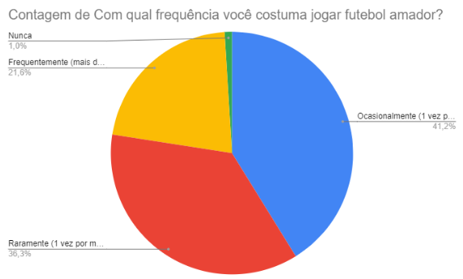
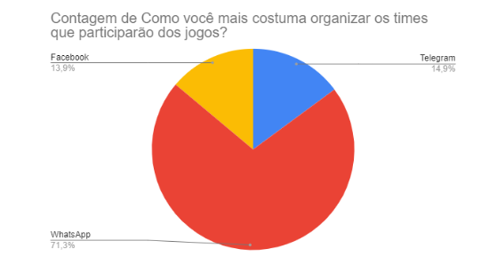
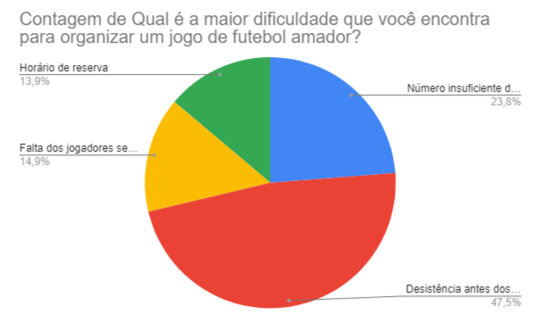
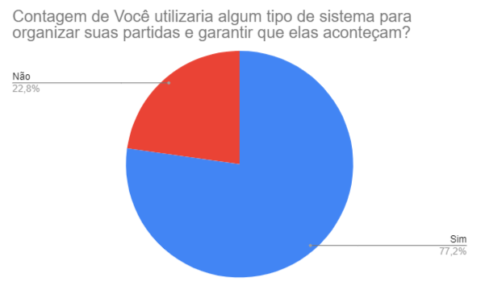
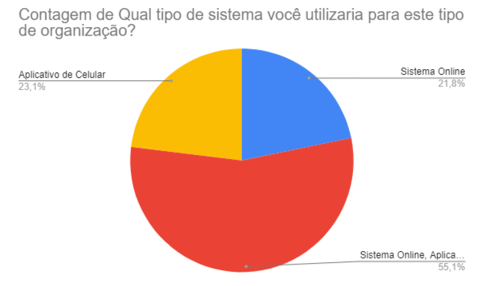

# Introdução

Com o passar do tempo, adquirimos novas responsabilidades e com isso o tempo livre que nos restava para organizar a diversão do fim de semana ou até mesmo o jogo sem compromisso no meio da semana ficou mais escasso. Considerando principalmente o período pós-pandemia, onde o isolamento social acabou extinguindo quase que completamente estes eventos de futebol amador, nos vemos em um momento de retorno à esse tipo de atividade, agora que grande parte da população já está no processo de vacinação.

Entretanto, nem sempre é simples para os amantes de futebol conseguirem organizar um evento como este com um número suficiente de pessoas para que a bola possa rolar. É claro que existem muitas pessoas por aí dispostas a jogar a qualquer instante, porém, muitas das vezes essas pessoas acabam enfrentando muitos problemas para adequar seus horários aos horários dos outros, ou até mesmo aos horários disponíveis em uma quadra que seja acessível. Além disso, podemos considerar o fato de que existem muitas pessoas que possivelmente moram a poucos quilômetros de você, ou até mesmo na sua rua, e o fato de vocês não se conhecerem ou não terem um certo nível de proximidade, torna impossível que estejam presentes em um mesmo evento de futebol, ou que vocês possam até mesmo se ajudar preenchendo uma vaga.

Portanto, a partir desses diversos problemas que estas pessoas enfrentam quando o assunto é jogos de futebol de bairro, faz-se necessário que hajam meios que interliguem os amadores em uma rede que possa aproximar pessoas desconhecidas que possuem os mesmos problemas e motivações, para que dessa forma possam compartilhar experiências, criar novos laços e aprender novas coisas.

## Problema

Conforme previamente estabelecido, o problema que este projeto se propõe a resolver é a organização de jogos de futebol amador, seja para aqueles que participam ativamente dos jogos ou proprietários de espaços para locação que recebem jogos de futebol.

## Objetivos

O objetivo principal do projeto é a criação de um portal que será acessível por qualquer dispositivo com acesso à Internet, apresentando ferramentas para cadastro de perfis de jogadores e espaços que receberão os jogos.

Como objetivos específicos, podemos listar:

- Fornecer funcionalidades que permitam o cadastro tanto dos jogadores quanto dos espaços para locação;
- Criação de uma lista de jogadores e espaços preferidos;
- Filtro de pesquisa de jogadores e espaços por suas características previamente cadastradas.

## Justificativa

Por meio de bate-papos com pessoas que vivem a realidade dos jogos de futebol amador, fica evidente que um sistema de organização dessa modalidade facilitaria e resolveria grande parte dos problemas de quem quer jogar, seja para se exercitar, se divertir ou apenas descontrair.

Realizamos uma pesquisa com uma amostra de 102 pessoas, que possivelmente seriam jogadoras de nível amador, onde o objetivo principal foi definir se para organizar um jogo amador havia de fato uma dificuldade em encontrar o número total de jogadores.

Identificamos que a maioria das pessoas que responderam a pesquisa organizam seus jogos através do WhatsApp, Telegram ou Facebook e de forma manual.

Também é possível identificar que os maiores problemas encontrados para realizar uma partida é a formação de um grupo de jogadores devido ao número insuficiente de jogadores para compor um time, desistência ou a falta de um ou mais jogadores sem aviso prévio, totalizando 86,2% dos entrevistados (86 pessoas).

Destas 86 pessoas que encontraram dificuldades para formar um time, foi direcionada uma pergunta para verificar se estes utilizariam um sistema para gerenciamento e garantia de que a partida acontecerá. Identificamos com esta pergunta que 77,2% das pessoas com este tipo de dificuldade (66 pessoas) utilizariam algum tipo de sistema.

Por fim, procuramos entender que tipo de sistema estas pessoas buscam para resolver a sua dor de não conseguir formar um grupo de jogadores para realizar a partida. Obtivemos respostas que identificaram um sistema online acessível pelo navegador ou um aplicativo de celular. Com isso, podemos observar a importância de um sistema responsivo, mesmo que desenvolvido apenas para a web.

## Público-Alvo

Levando em consideração o fato de que a prática de esportes deve ser um hábito constante para a manutenção da saúde de todos, o foco deste trabalho está no público praticante de exercícios físicos, mais especificamente aqueles que jogam futebol amador, também conhecido como “pelada”. Através do acesso à aplicação, é possível encontrar pessoas que possuem a mesma disponibilidade de dia e horário para a prática do esporte e a melhor quadra de acesso, alinhada com a região de cada um.
Sendo assim, o público-alvo do projeto são Homens e Mulheres, entre 18 e 45 anos, residentes de Belo Horizonte e região, praticantes de exercícios físicos, que jogam ou têm interesse em jogar futebol amador e que possuem dificuldades em encontrar jogadores(as) para a realização dos jogos, ou até mesmo uma quadra com disponibilidade e que se encaixe no horário de todos.
