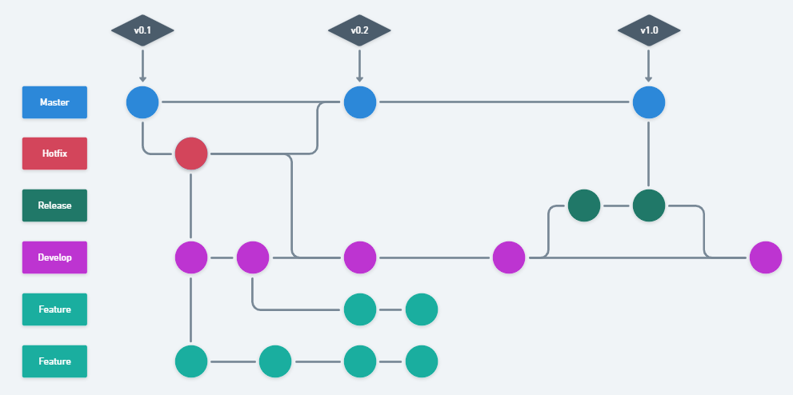

# Metodologia

Utilizaremos o Kanban pela ferramenta Trello, o quadro pode ser [acessado por este link](https://trello.com/invite/b/wXW23s3F/d3b31807c1695a722b31a0d2ba102c45/futnetwork). Alinhado ao Kanban, faremos reuniões para discutir backlog, refinamento de tarefas, priorização, dailys, alinhamentos semanais, como um SCRUM desestruturado para atender às necessidades atuais do grupo, podendo evoluir para a metodologia completa posteriormente.

## Controle de Versão

A ferramenta de controle de versão adotada no projeto foi o
[Git](https://git-scm.com/), sendo que o [Github](https://github.com)
foi utilizado para hospedagem do repositório.

O projeto segue a seguinte convenção para o nome de branches:

- `master`: versão em produção do software
- `develop`: versão de testes do software
- `feature/nome-do-branch`: versão de desenvolvimento de uma funcionalidade
- `release/nome-do-branch`: versão que reúne diversas funcionalidades para deploy
- `hotfix/nome-do-branch`: versão de correção urgente

Quanto à gerência de issues, o projeto adota a seguinte convenção para
etiquetas:

- `documentation`: melhorias ou acréscimos à documentação
- `bug`: uma funcionalidade encontra-se com problemas
- `enhancement`: uma funcionalidade precisa ser melhorada
- `feature`: uma nova funcionalidade precisa ser introduzida

Centralizaremos na branco `master` todo o código produtivo que já foi desenvolvido, testado e aprovado. Na branch `develop`, centralizaremos todo o código desenvolvido que necessita de testes e aprovações da equipe. Nas branches de prefixo `feature/*`, serão enviados os códigos de desenvolvimento da funcionalidade especifica nomeada ao branch e, por fim, nas branches de prefixo `release/*`, centralizaremos as funcionalidades competentes àquela versão de lançamento. Os branches de prefixo `hotfix/*` serão os responsáveis por correções extraordinárias e urgentes no sistema.

## Gerenciamento de Projeto

### Divisão de Papéis

Nesta sessão, serão definidos os papéis que o projeto exige que o grupo exerça sendo eles:

- Desenvolvimento:

Atividades de escrita de código a partir de uma tarefa.

- Gerenciamento de tarefas

_Backlog_:

Definição de tudo que a etapa atual do projeto necessita para ser entregue

_Priorização_:

Definição do que é mais importante ser entregue primeiro

_Refinamento_:

Definição do que deve ser desenvolvido

- Code Review

Revisão do código entregue por outros desenvolvedores para garantir a integridade do sistema

- Testes

Testes da aplicação para checar se o comportamento esperado foi entregue

### Equipe

#### Alyson Pereira

- Desenvolvimento
- Gerenciamento de tarefas
  - Backlog

#### Eduardo Vinícius

- Desenvolvimento
- Code Review
- Testes

#### Hendrie Wagner

- Desenvolvimento
- Gerenciamento de tarefas
  - Priorização

#### Henrique Balmant

- Gerenciamento de tarefas
  - Backlog
  - Priorização
  - Refinamento
- Code Review
- Testes

#### Pedro Lino

- Desenvolvimento
- Gerenciamento de tarefas
  - Refinamento
- Testes

### Processo

A metodologia SCRUM será desestruturada e alinhada com o [Kanban no Trello](https://trello.com/invite/b/wXW23s3F/d3b31807c1695a722b31a0d2ba102c45/futnetwork).
Começaremos a semana na segunda-feira às 19h com uma reunião de 1h15min para definição do backlog da semana, refinamento e priorização das tarefas. Nossa sprint começa aqui, com duração até a próxima sexta-feira.
Será feita uma reunião semanal toda segunda-feira às 20h15 com a orientadora do projeto para ciência das dificuldades e progresso no desenvolvimento.
De terça-feira à sexta-feira, faremos uma daily com duração de 15min às 20h para checkpoints com os donos das tarefas.
Teremos a possibilidade de reuniões extraordinárias de até 1h para resolução de problemas e discussões de ideias para implementação no projeto.

### Ferramentas

As ferramentas empregadas no projeto são:

- Editor de código padronizado: [VSCode](https://code.visualstudio.com/);
- Comunicação: Grupo de WhatsApp;
- Gerenciamento de tarefas: [Trello](https://trello.com/invite/b/wXW23s3F/d3b31807c1695a722b31a0d2ba102c45/futnetwork);
- Versionamento de código: [Github](https://github.com/ICEI-PUC-Minas-PMV-ADS/pmv-ads-2022-1-e1-proj-web-t6-grupo_2_futnetwork);
- Desenhos de tela (_wireframing_): [Whimsical](https://whimsical.com/futnetwork-CxPCbG5Va8Q9fyGJQiykSX);
- Desenhos de fluxos: [Whimsical](https://whimsical.com/futnetwork-CxPCbG5Va8Q9fyGJQiykSX);

O VSCode possui integração com o nossa ferramenta de versionamento de código, além de extensões que permitem simular um servidor local para exibir o conteúdo do projeto em tela, sem precisar de realizar deploys. A comunicação começou via um grupo do WhatsApp e decidimos manter por conta do histórico e por ser acessível para todos os integrantes. O Trello será utilizado para manter a organização do que deve ser feito e priorizado como ferramenta de Kanban. O Github é o repositório de código e interpretador de Git para versionamento deste. As telas e fluxos serão desenhadas no Whimsical por conhecimento prévio de um dos integrantes.
