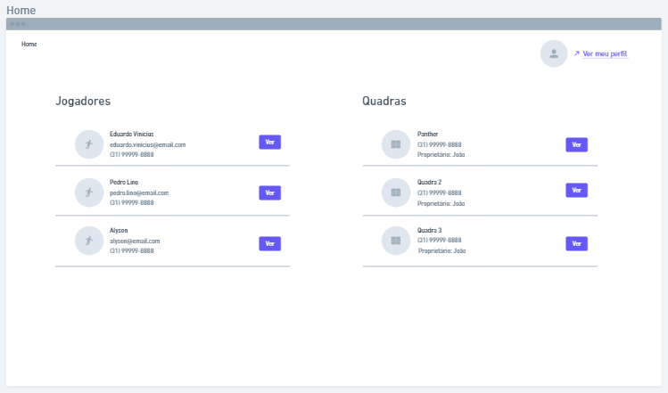

# Projeto de Interface

Visão geral da interação do usuário pelas telas do sistema e protótipo interativo das telas com as funcionalidades que fazem parte do sistema (wireframes).

## User Flow & Wireframes

Os protótipos de tela e os fluxos do usuário podem ser vistos na [plataforma Whimsical, por este link](https://whimsical.com/wireframe-user-flow-7r2nWrPU3GAnjzeS2pyVzF). Algumas imagens serão disponibilizadas abaixo.

### Tela de login

### Tela inicial

### Tela de perfil

