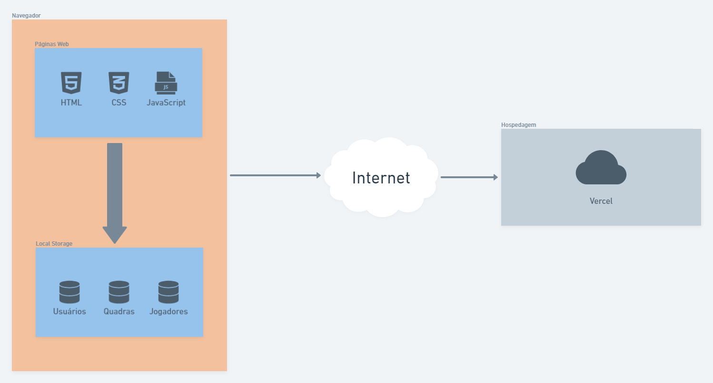
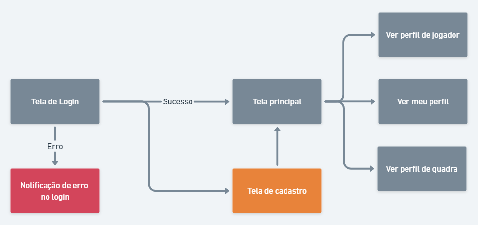
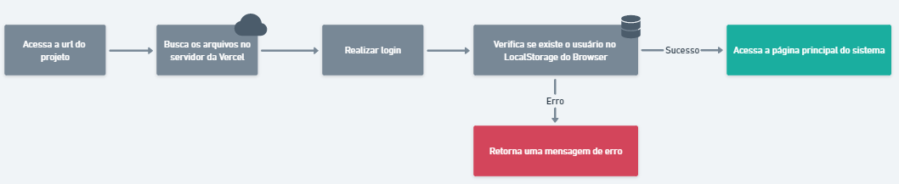

# Arquitetura da Solução

Definição de como o software é estruturado em termos dos componentes que fazem parte da solução e do ambiente de hospedagem da aplicação.

## Diagrama de componentes

A solução implementada conta com os seguintes módulos:

- **Navegador** - Interface básica do sistema
  - **Páginas Web** - Conjunto de arquivos HTML, CSS, JavaScript e imagens que implementam as funcionalidades do sistema.
  - **Local Storage** - armazenamento mantido no Navegador, onde são implementados bancos de dados baseados em JSON. São eles:
    - **Usuários** - seção de perfil do usuário
    - **Quadras** - lista de quadras cadastradas na plataforma
    - **Jogadores** - lista de jogadores cadastrados na plataforma
- **Hospedagem** - local na Internet onde as páginas são mantidas e acessadas pelo navegador.

A imagem acima ilustra a o fluxo do usuário em nossa solução. Assim que o usuário entra na plataforma, ele é apresentado à tela de login, onde ele é confrontado com o formulário de login ou a opção de realizar seu cadastro.

Caso ele opte por realizar o login, em caso de erro, ele é informado que alguma informação fornecida não está correta e pode realizar uma nova tentativa. Em caso de sucesso, ele acessa a página principal. Se o usuário optar por realizar o seu cadastro, após realizado, ele é redirecionado para a página principal.

Na página principal, ele visualiza duas listas: todos os jogadores (usuários) registrados e todas as quadras registradas, com um resumo de suas informações. É possível acessar o seu próprio perfil para configuração de suas informações, assim como visualizar os perfis dos jogadores e quadras específicos.

## Tecnologias Utilizadas

Utilizaremos o [VSCode](https://code.visualstudio.com/) como interface de desenvolvimento integrado, juntamente à extensão [Live Server](https://github.com/ritwickdey/vscode-live-server-plus-plus) para simular um servidor localmente e testar a aplicação, sem necessidade de rodar deploys.

As tecnologias utilizadas neste projeto serão HTML, CSS e JavaScript sem a utilização de nenhum framework, no intuito de remover camadas que não utilizaremos na aplicação e que possam interferir na usabilidade e impactar os usuários de qualquer forma.

Assim que o usuário acessar a URL do projeto, os arquivos HTML, CSS e JavaScript que estarão no servidor da Vercel serão carregados e exibidos em seu navegador. As interações acontecerão todas localmente utilizando a ferramenta de `LocalStorage` do próprio browser para armazenar, atualizar e excluir informações.

## Hospedagem

Utilizaremos a [Vercel](https://vercel.com/) como ferramenta de hospedagem e seguiremos a integração com o Github para deploy. A documentação desta integração pode ser [acessada por este link](https://vercel.com/docs/concepts/git/vercel-for-github).
